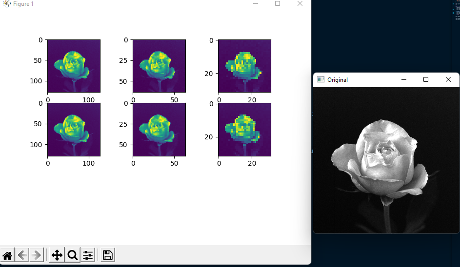
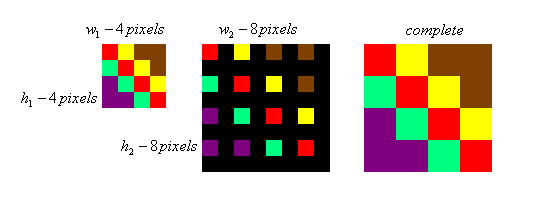
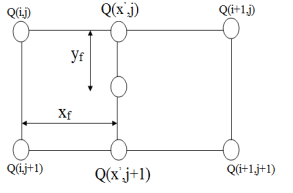
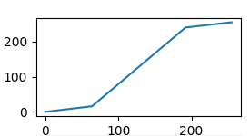

# Хэв танилтын үндэс лаб 2 | Тайлан

<h1>Даалгавар 1</h1>


```python

bit7 = (img/2)*2
plot = plt.subplot(2,4,1).imshow(bit7)

bit6 = (img/4)*4
plot = plt.subplot(2,4,2).imshow(bit6)

bit5 = (img/8)*8
plot = plt.subplot(2,4,3).imshow(bit5)

bit4 = (img/16)*16
plot = plt.subplot(2,4,4).imshow(bit4)

bit3 = (img/32)*32
plot = plt.subplot(2,4,5).imshow(bit3)

bit2 = (img/64)*64
plot = plt.subplot(2,4,6).imshow(bit2)

```

```python
output = img;
for i in range(len(img)):
  for j in range(len(img[0])):
    if img[i][j]>100:
      output[i][j] = 255
    else:
      output[i][j] = 0

plot = plt.subplot(2,4,8).imshow(output)
```

<!-- -------------------------------------------Даалгавар 2 -->
<h1>Даалгавар 2</h1>

Зургийн хэмжээ дэлгэцээс хэт том гарч ирж байсан болохоор хэмжээг 300,300-руу хэмжээрүү багасгаад эндээс өгөгдсөн хэмжээсүүд дээр ажиглалт хийсэн.

```python
ogImage = cv2.resize(image, [300,300]);
```

Доорх кодонд хэмжээсүүд өгөгдсөн байна. Лабын ажлын дагуу 128, 64, 32 гэдэг хэмжээсүүд дээр ажиллана.

```python
down = [
  [128,128],
  [64,64],
  [32,32]
]
```

Судалгааны ажиглалт хийх зорилгоор Figure ашиглав. Энийг *matplotlib* сангийн тусламжтайгаар гаргаж ирсэн.

```python
plt.figure(); #Figure үүсгэв.

j=1 #Энд Индекс өгөгдөнө 

for i in down:
  nearest_resize = cv2.resize(ogImage, i, interpolation=cv2.INTER_NEAREST);
  pic_plot = plt.subplot(3,3,j);
  pic_plot.imshow(nearest_resize);
  j+=1;

  linear_resize = cv2.resize(ogImage, i, interpolation=cv2.INTER_LINEAR);
  pic_plot = plt.subplot(3,3,j);
  pic_plot.imshow(linear_resize);
  j+=1;

plt.show()
```

<h2>Задлан шинжилгээ.</h2>
<hr>

Зураг, дүрстэй ажиллах сан буюу OpenCV нь **cv2**  гэсэн нэрээр ашиглаж байгаа.

Доорх кодонд resize хийх жишээ оров. **resize** функц нь 2-3 аргумент авах боломжтой. Эхлээд зураг дараа нь хэмжээс тэгээд ямар алгоритм ашиглаж хэмжээсийг өөрчлөх утга өгнө. Хэмжээс өөрчлөх алгоритмууд OpenCV санд байгаа ба **NEAREST** болон **LINEAR** гэсэн 2 алгоритмууд бэлээхэн байдаг.

```python
 cv2.resize(<Зураг>, [128, 128], interpolation=cv2.INTER_NEAREST);
```

figure дээр зургуудаа байрлуулж байна. Ерөнхийдөө subplot функц дуудсан. Тухайн Функц нь 3 аргумент авдаг ба багана, мөр, индекс гэсэн гурван утга авна. 3, 3 буюу 6 ширхэг байршил байдаг ба индексийн дагуу дарааллаж байрлана.
Тэгээд imshow функц ашиглаж figure дээр зурна.

```python
pic_plot = plt.subplot(багана,мөр,индекс);
pic_plot.imshow(зураг)
```

<h2>Үр дүн</h2>

Дээд мөрөнд **NEAREST**, доод мөрөнд **LINEAR** алгоритм ашиглан хэмжээсүүдийг өөрчилсөн.



>Дүгнэлт

Үр дүн дээр зургуудыг харьцуулж үзвэл багахан ялгаатай байхыг олж харна. 
Жишээлбэл **Nearest** алгоритм яаж ажиллаж байгааг ажиглавал...



Хөрш нүднүүдээ дүүргэх замаар resize хийж байна.

**BiLinear** манай сан дээр **Linear** гэх нэртэй байгаа. Энэ нь **Nearest**-ийн зарчимтай ерөнхийдөө адилхан гэхдээ ялгаа нь юу вэ гэвэл өнгөнийхөө дундаж утгаар дүүргэж явдаг.

Жишээлбэл A цэгээс B цэг хүртэл дундах нүднүүдийг A B -ийн дундаж утгаар дүүргэнэ. Доорх зургаас илүү ойлгомжтой харагдах байхаа.



<h1>Даалгавар 3</h1>

Бүх pixel үүдийн утгыг тодруулах функц байгаагүй учир доорх кодонд бичиж өгөв.

```python

def increase_brightness(img, value=30):
    hsv = cv2.cvtColor(img, cv2.COLOR_BGR2HSV) 
    h, s, v = cv2.split(hsv) 
    #Дээрх код нь Hue, Situation, Lightness задлаж хувиргаж авах үйлдэл

    # Энд гол тодруулах үйлдлийг хийнэ. Орж ирсэн "value" -аас хамаарч хэр зэрэг тодруулах үйлдлийг хийнэ. Дундаж буюу стандарт 225 байдаг ба 255-30 утга оноогоогүй тохиолдолд автоматаар өгөгдөнө 
    lim = 255 - value
    v[v > lim] = 255
    v[v <= lim] += value

    final_hsv = cv2.merge((h, s, v))
    img = cv2.cvtColor(final_hsv, cv2.COLOR_HSV2BGR)
    return img

```

<h1>Нэмэлт Ажил</h1>

> Ашигласан сан
- **OpenCV Python**
- **Matplot / matplotlib** График дүрслэл зураглал гаргах болон Octave -ийн figure subplot зэрэг зүйлсийг ашиглахад хэрэглэнэ.
- **Numpy** массив өгөгдөл дээр ажиллахад ашиглах сан.  

Уг даалгаварыг 2 аргаар гүйцэтгэсэн. Эхлээд бэлэн сан ашиглаж тодорхой утгуууд өгөөд зургийн гэрэлтүүлгийг ихэсгэх, багасгах үйлдлүүдийг хийсэн. Дараа нь лабораторын гарын авлаганд тусгагдсан томьёоны дагуу зургийн утгууд ажиллаж өөрчлөлт хийж үзсэн.

<h2>Opencv | LUT</h2>
<hr>
<p>
Эхлээд бид нэгэн сонирхолтой графикийг ажиглавал 0-255 утгатай хавтгайг ажиглана. Эндээс нэг шулуун 4 цэгт өөр байдлаар үргэжлэж байгааг харж болно. График юуг илэрхийлж байна вэ? гэвэл аль баганад ямар утга авч харлуулах болон цагааруулах үйлдлийг хийж болох вэ гэдэг мэдээг өгнө. 
</p>


>  
<p>

</p>